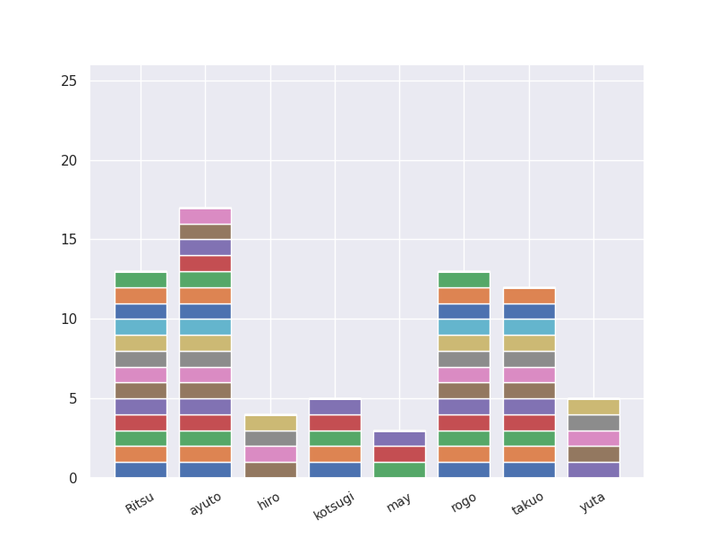

# React/Next.js勉強会
React/Next.js勉強会用のリポジトリです。
教材URL: https://nextjs.org/learn/react-foundations

毎週基本4章分解いてください。
勉強会の時間には、事前に割り当てられた章の内容の解説をしてもらいます。

## usage
初回はこのレポジトリを clone してください。
```
$ git clone https://github.com/Atotti/Next.js-tutorial.git
```
コードを書いたら remote repository に push してください。 チャプター名は二桁の数字にしてください（例: chapter01）。
```
$ git branch <任意のブランチ名(以下、b_name)> (e.g. git branch ayuto)
$ git checkout <b_name>
$ git add <任意のファイル・フォルダ> (e.g. git add ./ayuto/chapter01/index.html)
$ git commit -m 'your message'
$ git pull origin main
$ git push origin <b_name>
```
## 注意事項
わからないところは積極的にDiscord等で質問してください。 他の人のディレクトリを変更することは絶対にやめてください。 （他の人のコードを閲覧したい場合は、Web サイト上から閲覧してください。） chapter##/ のフォルダ名を間違えると進捗グラフに反映されません。

## みんなの進捗

