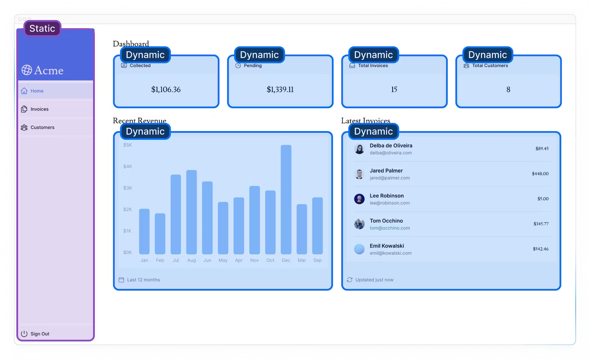
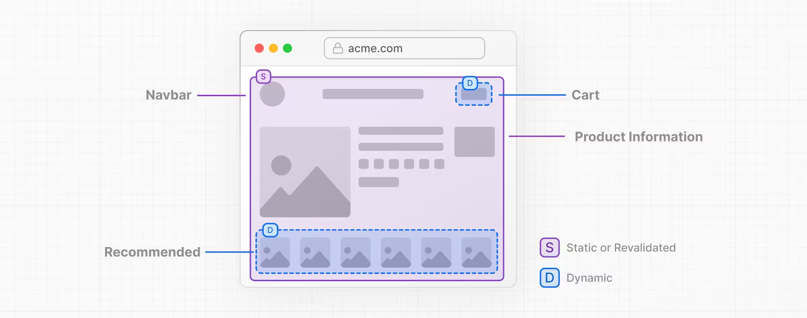

# PPR(Partial Prerendering)

この章のトピック
- PPR（部分プリレンダリング）とは何か
- PPRの仕組み

## 静的コンテンツと動的コンテンツの結合
現在、ルート内で動的関数(`noStote()`, `cookies()`)を呼び出すとルート全体が動的になる。
これが今日のほとんどのWebアプリの構築方法であり、アプリケーション全体、または特定のルートで動的か静的なレンダリングを選ぶことができる。
ただし、ほとんどのルートは完全に静的または動的ではありません。静的コンテンツと動的コンテンツの両方を含むルートがある場合がある。たとえばECサイトでは、商品ページの大部分を事前にレンダリングできる場合もありますが、ユーザーのカートや推奨される商品をオンデマンドで動的に取得したい場合もある。

### ダッシュボードページにおける動的・静的コンテンツ

- `<SideNav>`コンポーネントはデータに依存せず、ユーザーに合わせてカスタマイズされていないため、静的にすることができる。
- `<Page>`コンポーネントは頻繁に変更されるデータに依存しており、ユーザーに合わせてカスタ
- 静的ルートシェルが提供されるため、初期ロードが高速になる。
- シェルには、動的コンテンツがマイズされるため、動的である。

## PPRとは
ルートの動的部分を分離することができる、Next.js 14 の実験的な機能。

ユーザーがルートを訪問すると、非同期で読み込まれる hole が残る。
- 非同期の hole は並行してストリーミングされるため、ページの全体的な読み込み時間が短縮される。
これは、ルート全体が完全に静的または動的である現在のアプリケーションの動作とは異なります。

PPRは、超高速の静的エッジ配信と完全な動的機能を組み合わせたもので、Webアプリのデフォルトのレンダリングモデルになる可能性があると考えている。静的サイト生成と動的配信の長所を組み合わせます。

## PPRはどのように機能するのか
PPRはReactの`Concurrent API`, `Suspense`を使用して、何らかの条件が満たされるまで、アプリケーションのレンダリングを延期する。（データがロードされるまでなど）

フォールバックは、ほかの静的コンテンツとともに初期静的ファイルに埋め込まれる。ビルド時にルートの静的部分が事前レンダリングされ、残りの部分はユーザーがリクエストするまで延期される。

PPRは、Suspenseを使用してルートの動的部分をラップしている限り、Next.jsはどの部分が静的でどの部分が動的かを認識するため、コードを変更する必要はない。

