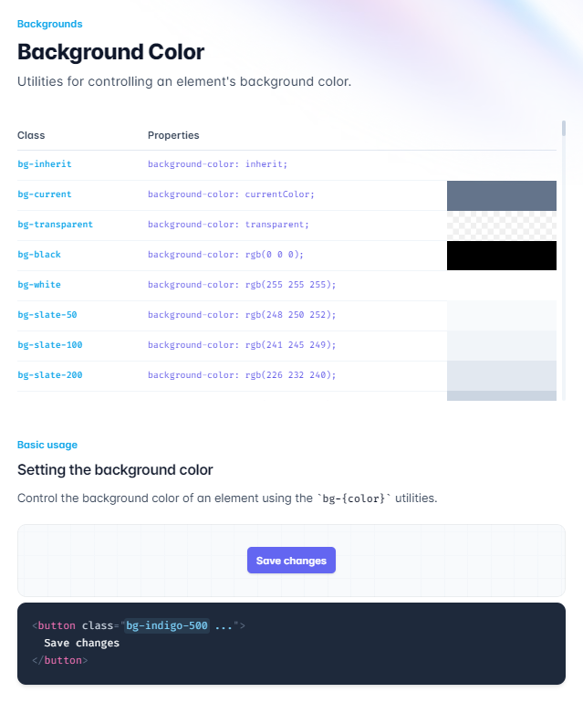
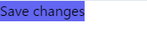
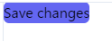
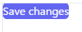
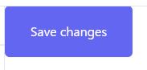
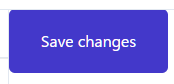
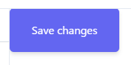

# CSSについて
このチュートリアルでは、ここまで色々な箇所で`className`に`Tailwind CSS`を記述してデザインを作成してきた。
また、`className`内部で条件分岐をするために`clsx`等も用いてきた。が、これはあくまでオマケで、デザインの書き方としては完全に`Tailwind`を使っている。
正直に言ってこの(例)のclassNameは**呪文**で、このチュートリアルをやっていても意味が不明だった。

例
```jsx
<Link
    key={link.name}
    href={link.href}
    className={clsx(
            'flex h-[48px] grow items-center justify-center gap-2 rounded-md bg-gray-50 p-3 text-sm font-medium hover:bg-sky-100 hover:text-blue-600 md:flex-none md:justify-start md:p-2 md:px-3',
                {
                    'bg-sky-100 text-blue-600': pathname === link.href, // pathnameとlink.hrefが一致するときは青色にする
                },
        )
    }
>
```

Web開発にあたり。これを書けるようになるになる必要があるのだろうか？答えとしては、その必要は無いと自分は考えている。理由は2つある。

## 理由1 Tailwind CSS チートシートを使う
チートシートはいくつかあるが、ここでは[公式ドキュメント](https://tailwindcss.com/docs/installation)を参照する。

### 使い方
例えばボタンのデザインを書きたいとする。
ボタンのデザインと言ったら、背景に丸い色つきの図形を置いて、文字色を白にして、ホバー時のアニメーションを付ければ良さそうだ。
公式ドキュメントの[backgournd color](https://tailwindcss.com/docs/background-color)を見ると、


こんな感じで例とコードが載ってるのでコピペすれば良い。

```html
<button class="bg-indigo-500">
  Save changes
</button>
```

すると、こんな感じで背景色が付く。


次に背景が四角いので角丸にしたい。

公式ドキュメントの[Rounded corners](https://tailwindcss.com/docs/border-radius#rounded-corners)を見て、良さげなのを選んでコピペする。

```html
<button class="bg-indigo-500 rounded-md">
  Save changes
</button>
```



次に文字色を白にする。同様に[Text Color](https://tailwindcss.com/docs/text-color)を見てコピペする。

```html
<button class="bg-indigo-500 rounded-md text-white">
  Save changes
</button>
```



次に文字が詰まっているので`padding`を追加する。[ココ](https://tailwindcss.com/docs/padding)をみて、
こうする。
```html
<button class="bg-indigo-500 rounded-md text-white px-8 py-5">
  Save changes
</button>
```



次にホバーしたときに色を変えたいので[Hovar](https://tailwindcss.com/docs/hover-focus-and-other-states)をみて、
こうする。

```html
<button class="bg-indigo-500 rounded-md text-white px-8 py-5 hover:bg-indigo-700 ">
  Save changes
</button>
```

※`bg-indigo-700`の`700`はどうやら色の濃さを表しているようで、通常時`bg-indigo-500`をホバー時`hover:bg-indigo-700`になるようになった。



最後に影も追加してみる。

[Drop Shadow](https://tailwindcss.com/docs/drop-shadow)を見て

```html
<button class="bg-indigo-500 rounded-md text-white px-8 py-5 hover:bg-indigo-700 drop-shadow-md">
  Save changes
</button>
```




以下のリンクから作ったボタンのデザインが見れるので見てみてほしい。
[https://play.tailwindcss.com/TCzxFGDVBm](https://play.tailwindcss.com/TCzxFGDVBm)

このように、Tailwindのことは良く知らないが、ボタンのデザインを書く**呪文**を作成することが出来た。

```
bg-indigo-500 rounded-md text-white px-8 py-5 hover:bg-indigo-700 drop-shadow-md
```

これが、理由1である。

## 理由2 UIフレームワークを使えばCSSはそもそも書かない
独自にデザインを作成し実装したいとなれば話は別で、CSSを書く(生成する^1)必要が生じるので、上のようにコピペしながら書く必要があるが、
実際のWeb開発ではそもそも独自のデザインを導入したくなることは少ない。あっても色をカスタマイズする程度でよくあるデザインを使わせてもらえばよいし、
大抵の場合、その方が見栄えも良い。

そこで使えるのが**UIフレームワーク**である。

ここではUIフレームワークの一種である**MUI**を紹介する。

[likes button](../chapter07/index.html)

このボタンはMUIを使って実装した。MUIは**Reactのコンポーネント**を提供してくれる。

例えばMUIが提供する`Button`コンポーネントを使えば以下のように書くだけでいい感じのボタンが完成する。

```tsx
import { Button } from '@mui/material';

export default function Page() {
    return (
        <Button variant='contained' color='primary'>ボタン</Button>
    );
  }
```
- variant='contained'で背景を塗りつぶすか選択
- color='primary'でprimaryに設定した色を選択

これだけで良い。

MUIはボタン以外にも一般に必要になるUIコンポーネントを多く提供しているため、これを使うだけでCSSなど書かなくてよくなるのだ！！！！！素晴らしい。

これはReactの再利用なコンポーネント化の恩恵を受けれる最たる例だと個人的に思う。

※生成する^1 : figma等ではTailwind形式でCSS出力が出来るらしい(良く知らない)