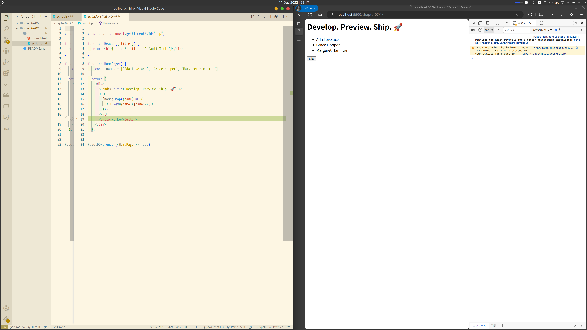
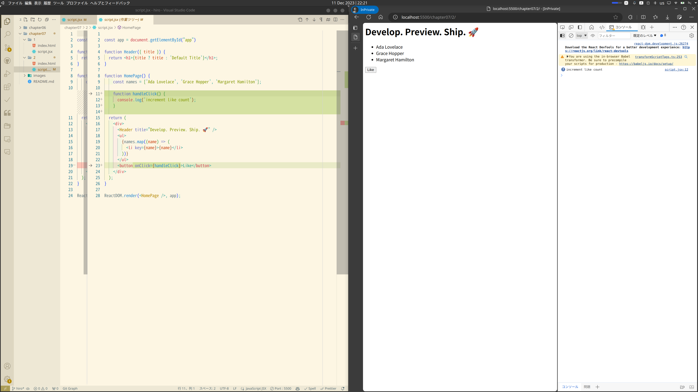
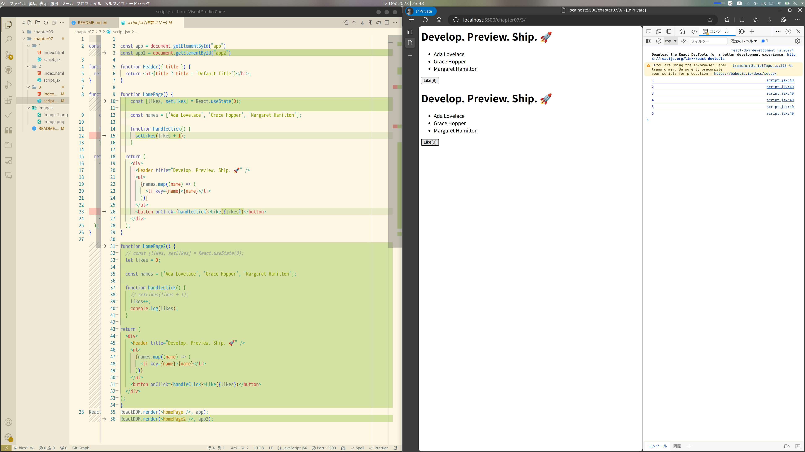

### ボタンの追加
まだ押しても何も起きない


### イベントの追加
onClickでクリック時に指定した関数を呼び出せる
関数をそのものを渡しているイメージ

ほかにもいろいろある
| イベントハンドラ | 説明 |
| --- | --- |
| onBlur / onFocus | フォーカスが移動したとき |
| onChange | フォームの入力値 / 選択が変更されたとき |
| onSelect / onSelectStart | テキストが選択されたとき |
| onSubmit / onReset | フォームの送信時 / リセット時 |
| onAbort / onError | 画像読み込み時の中断 / エラー |
| onLoad / onUnload | ページの読み込み時 / 切り替え時 |
| onClick / onDblClick | クリック / ダブルクリックされたとき |
| onKeyPress / onKeyDown / onKeyUp | キーの状態に応じる |
| onMouseOver / onMouseOut | マウスを乗せたとき / 離したとき |
| onMouseDown / onMouseUp | マウスでクリックしたとき |
| onMousemove | マウスを動かしているとき |
引用：[Reactのイベント処理を理解しよう](https://qiita.com/jima-r20/items/839da7c2f26366491298#%E3%82%A4%E3%83%99%E3%83%B3%E3%83%88%E3%83%8F%E3%83%B3%E3%83%89%E3%83%A9%E4%B8%80%E8%A6%A7)

### ステートとフック
#### レンダリングの動作
Reactは**仮想DOM**と呼ばれる，DOMに対応するデータ構造を保持してレンダリングを管理する．

仮想DOMは，関数コンポーネントが呼び出されることによって生成される．

コンポーネントを再レンダリングするときには，前回の仮想DOMと新しく生成した仮想DOMを比較して差分を計算し，必要な最小限の変更を実際のDOMに加える（つまり，レンダリングのたびに関数コンポーネントは新しく呼び出される！）．

このため，レンダリング間で保持すべきデータはローカル変数でなく専用の`state`を使う必要がある．

### ステート
レンダリング間でデータを保持することができる変数．

[Reactのチュートリアル](https://ja.react.dev/learn/state-a-components-memory)には「コンポーネント固有のメモリ」と書いてある．

ステートが変更されるとコンポーネントが再レンダリングされる．

### フック
Reactにおいて`use`で始まる特別な関数．

コンポーネントの内部からReactの機能に「接続 (hook into)」することができる．

例えば，`useState`フックを使うことでステートを定義できる．

### ステートの使い方
`useState`フックは初期値を受け取り`state`と変更のためのセッタ関数を返す．

こんな感じ．
```javascript
const [state, setState] = useState(0);

console.log(state); // 0
setState(1);
console.log(state); // 1
```
代入とかしちゃだめなので`const`で宣言する．



### おまけ
#### 再レンダリングのタイミング
- stateが更新された時
- propsが更新された時
- 親コンポーネントが再レンダリングされた時

#### 仮想DOMって実際どんなの？
GPTに書いてみてもらった．
```javascript
const virtualDOM = {
  type: 'div',
  props: {
    className: 'container',
    children: [
      {
        type: 'h1',
        props: {
          children: '仮想DOMの例'
        }
      },
      {
        type: 'p',
        props: {
          children: 'これは仮想DOMの単純な例です。'
        }
      }
    ]
  }
};
```
これが次のHTMLに相当する．
```html
<div class="container">
  <h1>仮想DOMの例</h1>
  <p>これは仮想DOMの単純な例です。</p>
</div>
```

#### フックいろいろ

| hook | 説明 |
| --- | --- |
| useState | ステート定義 |
| useEffect | 副作用 |
| useContext | propsを使わない共有 |
| useReducer | stateみたいなやつよくわからん |
| useCallback | コールバック関数メモ化 |
| useMemo | 関数コンポーネントメモ化 |
| useRef | stateみたいなやつよくわからん2 再レンダリングしないとかなんとか |
参考：[React Hooksの一覧や用途をまとめてみた：その１](https://shiro-secret-base.com/react-hooks%E3%81%AE%E4%B8%80%E8%A6%A7%E3%82%84%E7%94%A8%E9%80%94%E3%82%92%E3%81%BE%E3%81%A8%E3%82%81%E3%81%A6%E3%81%BF%E3%81%9F%EF%BC%9A%E3%81%9D%E3%81%AE%EF%BC%91/)

### 参考にしたサイト
- https://ja.react.dev/learnstate-a-components-memory
- https://ja.react.dev/learn/render-and-commit
- https://zenn.dev/b1essk/articles/react-re-rendering
- https://qiita.com/seira/items/0e6a2d835f1afb50544d