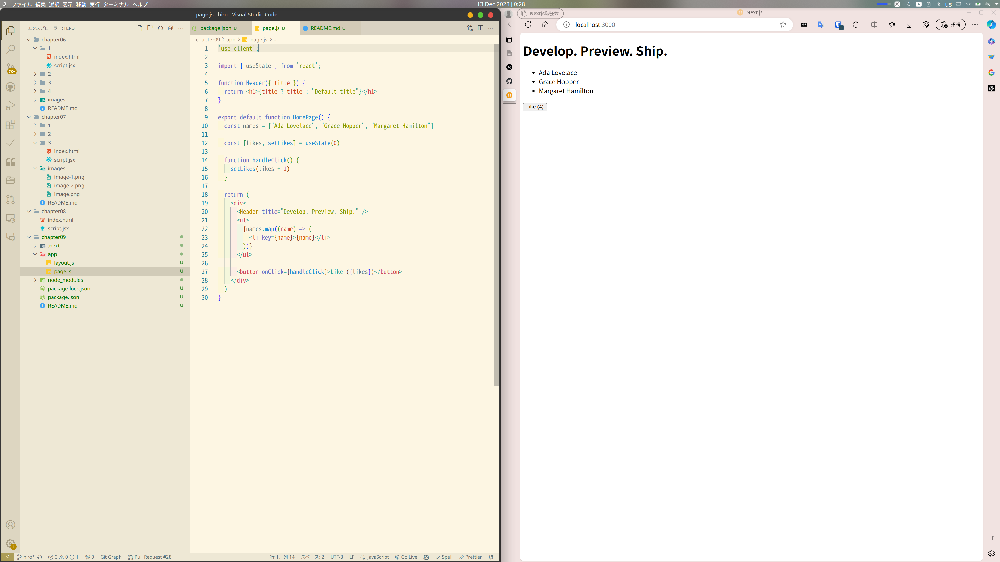

### ReactとNext.jsをローカルに
今まではCDN的な感じでAPIを通して使っていた（たぶん）

package.json
```json
{}
```

いんすとーる！！
```shell-session
npm install react@latest react-dom@latest next@latest
```

これで`import`することでReactその他を使えるようになった

のでいらないのけす

- <html>と<body>
- <div id="app">
- reactとreact-domのscript
- babel（Nextjsがコンパイラ持ってる）（すごい）
- <script type="text/jsx">
- document.getElementById と ReactDOM.render()
- React.useStateのReact.

importする
```javascript
import { useState } from 'react';
```

開発サーバーを建てる
package.jsonについか
```json
  "scripts": {
    "dev": "next dev"
  },
```

クライアントコンポーネントにする
page.jsの頭にかく
```javascript
'use client';
```

きちゃーー
