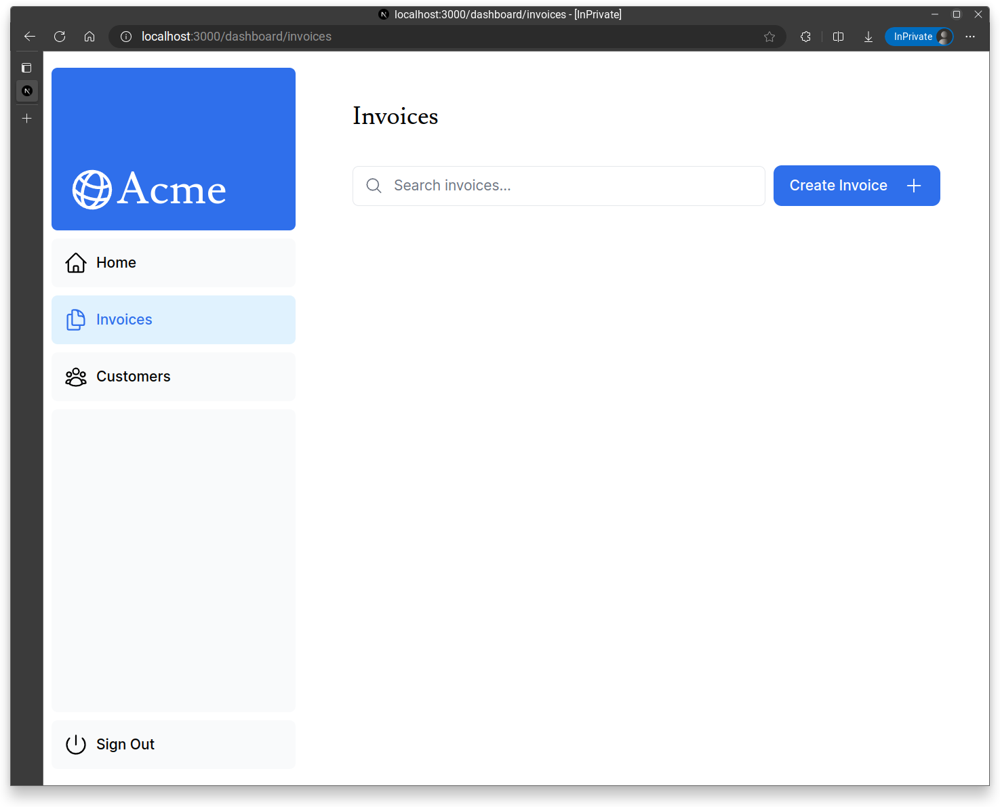
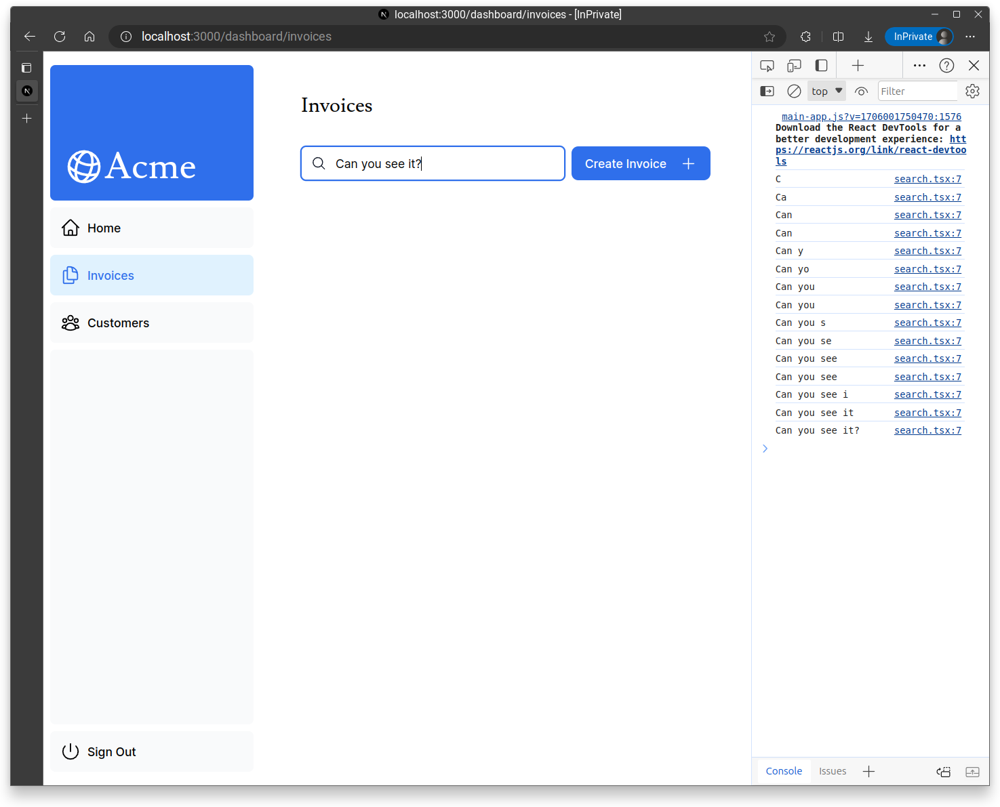
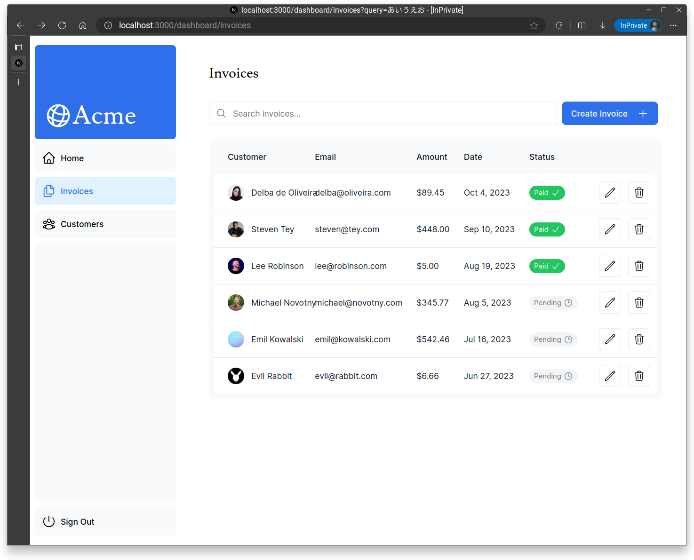
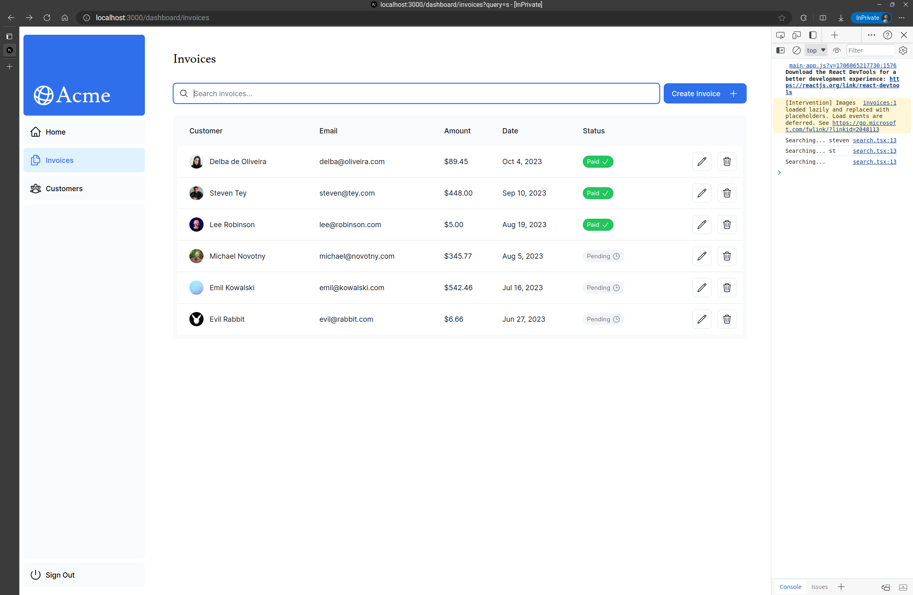
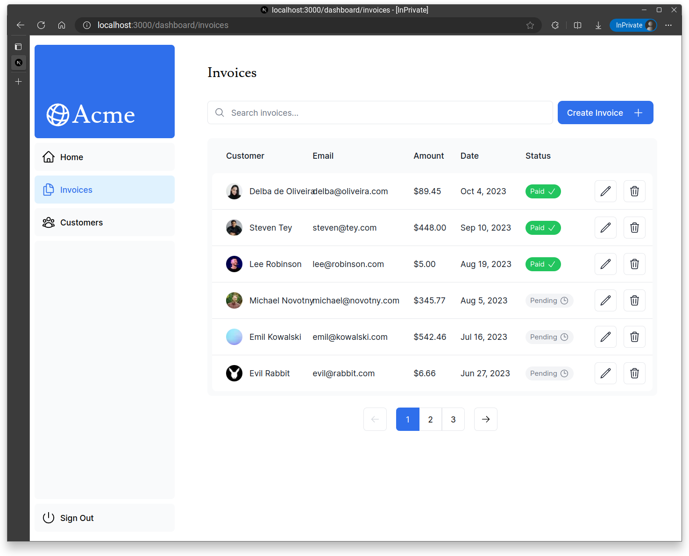

## 検索とページネーション
`/app/dashboard/invoices`ページをいじっていく．

```tsx:invoices/page.tsx
import Pagination from '@/app/ui/invoices/pagination';
import Search from '@/app/ui/search';
import Table from '@/app/ui/invoices/table';
import { CreateInvoice } from '@/app/ui/invoices/buttons';
import { lusitana } from '@/app/ui/fonts';
import { InvoicesTableSkeleton } from '@/app/ui/skeletons';
import { Suspense } from 'react';

export default async function Page() {
  return (
    <div className="w-full">
      <div className="flex w-full items-center justify-between">
        <h1 className={`${lusitana.className} text-2xl`}>Invoices</h1>
      </div>
      <div className="mt-4 flex items-center justify-between gap-2 md:mt-8">
        <Search placeholder="Search invoices..." />
        <CreateInvoice />
      </div>
      {/*  <Suspense key={query + currentPage} fallback={<InvoicesTableSkeleton />}>
        <Table query={query} currentPage={currentPage} />
      </Suspense> */}
      <div className="mt-5 flex w-full justify-center">
        {/* <Pagination totalPages={totalPages} /> */}
      </div>
    </div>
  );
}
```
コピペしただけ．

- `Search`コンポーネント：検索バー
- `CreateInvoice`コンポーネント：右の青いボタン



### 検索機能の追加

`Search`コンポーネントに入力した文字は何らかの形で保持される必要がある．ここではステートは使わず，URLクエリパラメータに保持する．

つまり流れとしては，
1. `Search`コンポーネントになにか入力する
2. 入力された内容がクエリパラメータに反映される
3. クエリパラメータを参照してDBから該当するデータを持ってくる

という感じ．

あえてクエリパラメータを使う利点は，
- ブックマークや共有ができるようになる
- サーバーサイドでレンダリングできる（stateはクライアントコンポーネントでしか使えない）

```tsx:search.tsx
'use client';

import { MagnifyingGlassIcon } from '@heroicons/react/24/outline';

export default function Search({ placeholder }: { placeholder: string }) {

  function handleSearch(term: string) {
    console.log(term);
  }

  return (
    <div className="relative flex flex-1 flex-shrink-0">
      <label htmlFor="search" className="sr-only">
        Search
      </label>
      <input
        className="peer block w-full rounded-md border border-gray-200 py-[9px] pl-10 text-sm outline-2 placeholder:text-gray-500"
        placeholder={placeholder}

        onChange={(e) => {
          handleSearch(e.target.value);
        }}

      />
      <MagnifyingGlassIcon className="absolute left-3 top-1/2 h-[18px] w-[18px] -translate-y-1/2 text-gray-500 peer-focus:text-gray-900" />
    </div>
  );
}
```


```tsx:search.tsx
'use client';

import { MagnifyingGlassIcon } from '@heroicons/react/24/outline';
import { useSearchParams, usePathname, useRouter } from 'next/navigation';

export default function Search({ placeholder }: { placeholder: string }) {
  const searchParams = useSearchParams();
  const pathname = usePathname();
  const { replace } = useRouter();

  function handleSearch(term: string) {
    const params = new URLSearchParams(searchParams);
    if (term) {
      params.set('query', term);
    } else {
      params.delete('query');
    }
    replace(`${pathname}?${params.toString()}`);
  }
  return (
    <div className="relative flex flex-1 flex-shrink-0">
      <label htmlFor="search" className="sr-only">
        Search
      </label>
      <input
        className="peer block w-full rounded-md border border-gray-200 py-[9px] pl-10 text-sm outline-2 placeholder:text-gray-500"
        placeholder={placeholder}
        onChange={(e) => {
          handleSearch(e.target.value);
        }}
      />
      <MagnifyingGlassIcon className="absolute left-3 top-1/2 h-[18px] w-[18px] -translate-y-1/2 text-gray-500 peer-focus:text-gray-900" />
    </div>
  );
}
```


`input`タグの`defaultValue`属性にデフォルト値を入れられる．
```tsx
      <input
        className="peer block w-full rounded-md border border-gray-200 py-[9px] pl-10 text-sm outline-2 placeholder:text-gray-500"
        placeholder={placeholder}
        onChange={(e) => {
          handleSearch(e.target.value);
        }}
        defaultValue={searchParams.get('query')?.toString()}
      />
```
（ただし`state`で管理する場合は`value`属性を使う．）

```tsx:invoices/page.tsx
import Pagination from '@/app/ui/invoices/pagination';
import Search from '@/app/ui/search';
import Table from '@/app/ui/invoices/table';
import { CreateInvoice } from '@/app/ui/invoices/buttons';
import { lusitana } from '@/app/ui/fonts';
import { InvoicesTableSkeleton } from '@/app/ui/skeletons';
import { Suspense } from 'react';

export default async function Page({
  searchParams,
}: {
  searchParams?: {
    query?: string;
    page?: string;
  };
}) {
  const query = searchParams?.query || '';
  const currentPage = Number(searchParams?.page) || 1;

  return (
    <div className="w-full">
      <div className="flex w-full items-center justify-between">
        <h1 className={`${lusitana.className} text-2xl`}>Invoices</h1>
      </div>
      <div className="mt-4 flex items-center justify-between gap-2 md:mt-8">
        <Search placeholder="Search invoices..." />
        <CreateInvoice />
      </div>
       <Suspense key={query + currentPage} fallback={<InvoicesTableSkeleton />}>
        <Table query={query} currentPage={currentPage} />
      </Suspense>
      <div className="mt-5 flex w-full justify-center">
        {/* <Pagination totalPages={totalPages} /> */}
      </div>
    </div>
  );
}
```


#### `useSearchParams()`フックと`searchParams`プロップス

### デバウンス
現状では1文字ごとにクエリが送信されてしまい，よくない．

**デバウンス**は，こういう時に関数の実行頻度を下げるプログラミング手法で，次のように動作する．
1. 関数がトリガーされてから実際に実行されるまでに待ち時間を設ける．
2. 関数のトリガー中に新たに関数がトリガーされたら待ち時間をリセットする．

今回は[`use-debounce`](https://www.npmjs.com/package/use-debounce)というReactのライブラリを使う．

```shell-session
> npm i use-debounce

added 1 package, and audited 575 packages in 1s

172 packages are looking for funding
  run `npm fund` for details

found 0 vulnerabilities

```

```tsx:search.tsx
'use client';

import { MagnifyingGlassIcon } from '@heroicons/react/24/outline';
import { useSearchParams, usePathname, useRouter } from 'next/navigation';
import { useDebouncedCallback } from 'use-debounce';

export default function Search({ placeholder }: { placeholder: string }) {
  const searchParams = useSearchParams();
  const pathname = usePathname();
  const { replace } = useRouter();

  const handleSearch = useDebouncedCallback((term) => {
    console.log(`Searching... ${term}`);

    const params = new URLSearchParams(searchParams);
    if (term) {
      params.set('query', term);
    } else {
      params.delete('query');
    }
    replace(`${pathname}?${params.toString()}`);
  }, 300);
  return (
    <div className="relative flex flex-1 flex-shrink-0">
      <label htmlFor="search" className="sr-only">
        Search
      </label>
      <input
        className="peer block w-full rounded-md border border-gray-200 py-[9px] pl-10 text-sm outline-2 placeholder:text-gray-500"
        placeholder={placeholder}
        onChange={(e) => {
          handleSearch(e.target.value);
        }}
        defaultValue={searchParams.get('query')?.toString()}
      />
      <MagnifyingGlassIcon className="absolute left-3 top-1/2 h-[18px] w-[18px] -translate-y-1/2 text-gray-500 peer-focus:text-gray-900" />
    </div>
  );
}

```



### ペジネーション
ページに分割して表示できるようにする．

```tsx:invoices/page.tsx
import Pagination from '@/app/ui/invoices/pagination';
import Search from '@/app/ui/search';
import Table from '@/app/ui/invoices/table';
import { CreateInvoice } from '@/app/ui/invoices/buttons';
import { lusitana } from '@/app/ui/fonts';
import { InvoicesTableSkeleton } from '@/app/ui/skeletons';
import { Suspense } from 'react';
import { fetchInvoicesPages } from '@/app/lib/data';

export default async function Page({
  searchParams,
}: {
  searchParams?: {
    query?: string;
    page?: string;
  };
}) {
  const query = searchParams?.query || '';
  const currentPage = Number(searchParams?.page) || 1;

  const totalPages = await fetchInvoicesPages(query);

  return (
    <div className="w-full">
      <div className="flex w-full items-center justify-between">
        <h1 className={`${lusitana.className} text-2xl`}>Invoices</h1>
      </div>
      <div className="mt-4 flex items-center justify-between gap-2 md:mt-8">
        <Search placeholder="Search invoices..." />
        <CreateInvoice />
      </div>
      <Suspense key={query + currentPage} fallback={<InvoicesTableSkeleton />}>
        <Table query={query} currentPage={currentPage} />
      </Suspense>
      <div className="mt-5 flex w-full justify-center">
        <Pagination totalPages={totalPages} />
      </div>
    </div>
  );
}
```

```tsx
export default function Pagination({ totalPages }: { totalPages: number }) {
  const pathname = usePathname();
  const searchParams = useSearchParams();
  const currentPage = Number(searchParams.get('page')) || 1;

  const createPageURL = (pageNumber: number | string) => {
    const params = new URLSearchParams(searchParams);
    params.set('page', pageNumber.toString());
    return `${pathname}?${params.toString()}`;
  };

  // NOTE: comment in this code when you get to this point in the course

  const allPages = generatePagination(currentPage, totalPages);

  return (
    <>
      {/* NOTE: comment in this code when you get to this point in the course */}

      <div className="inline-flex">
        <PaginationArrow
          direction="left"
          href={createPageURL(currentPage - 1)}
          isDisabled={currentPage <= 1}
        />

        <div className="flex -space-x-px">
          {allPages.map((page, index) => {
            let position: 'first' | 'last' | 'single' | 'middle' | undefined;

            if (index === 0) position = 'first';
            if (index === allPages.length - 1) position = 'last';
            if (allPages.length === 1) position = 'single';
            if (page === '...') position = 'middle';

            return (
              <PaginationNumber
                key={page}
                href={createPageURL(page)}
                page={page}
                position={position}
                isActive={currentPage === page}
              />
            );
          })}
        </div>

        <PaginationArrow
          direction="right"
          href={createPageURL(currentPage + 1)}
          isDisabled={currentPage >= totalPages}
        />
      </div>
    </>
  );
}
```
